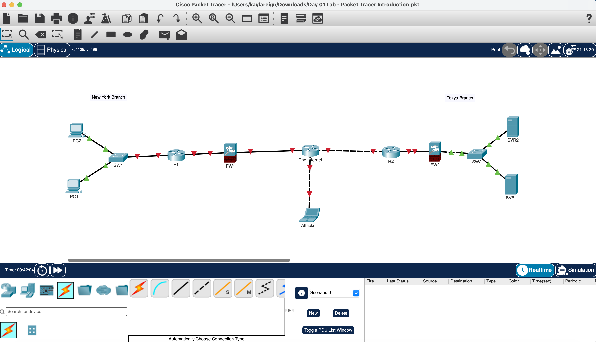

# Lab 01 — Packet Tracer Introduction

## Overview

This was my introduction to **Cisco Packet Tracer** and working with a visual network topology.

I completed a network representing New York and Tokyo branch LANs connected through an Internet/WAN segment while becoming familiar with common network devices and how they connect.

## What I Did

I practiced:

- Navigating Cisco Packet Tracer
- Identifying routers, switches, firewalls, PCs, and servers
- Adding and positioning network devices
- Connecting devices through the appropriate interfaces
- Recognizing how different devices fit into a larger network topology

### Completed Topology

*Completed Cisco Packet Tracer topology for Lab 01.*

The topology included:

- **New York:** PC1 and PC2 → SW1 → R1 → FW1 → Internet
- **Tokyo:** Internet → R2 → FW2 → SW2 → SVR1 and SVR2
- An external **Attacker** laptop connected to the Internet segment

## Verification

I verified the completed lab by confirming:

- All required devices were present
- Devices were placed in the correct areas of the topology
- The required connections were completed
- Both branch LANs were connected through the Internet/WAN portion of the topology

## What I Learned

- PCs and servers operate as end devices.
- Switches connect devices within a LAN.
- Routers connect different networks.
- Firewalls provide security controls between network segments.
- Packet Tracer allows me to visually build and examine how individual network devices work together as a complete network.

## Study Source

Completed as part of my CCNA studies using **Jeremy's IT Lab**.

This is **Lab 01** in my GitHub CCNA lab portfolio.
