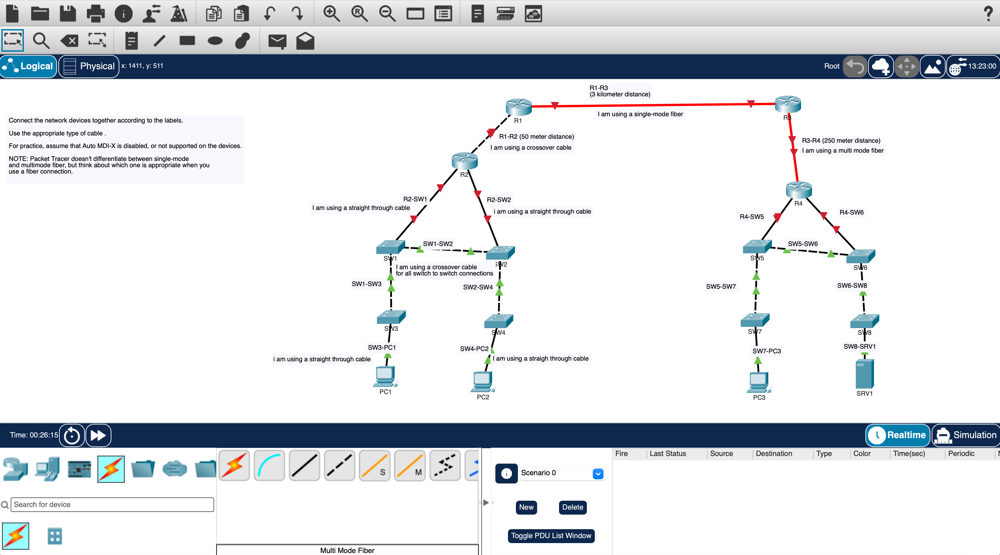
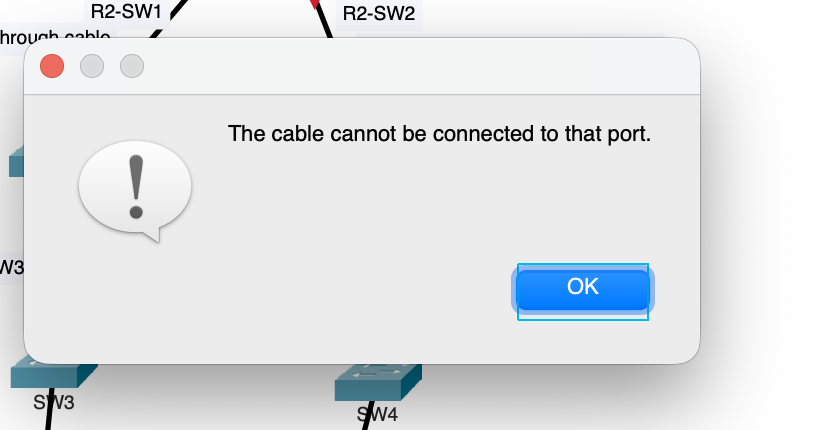
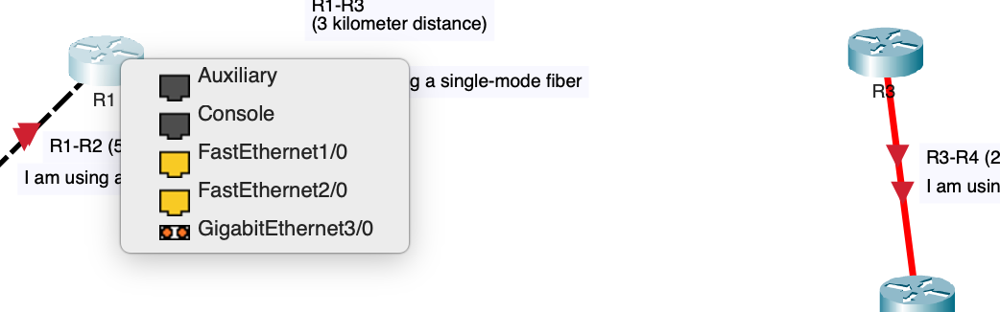

# Lab 02 — Connecting Network Devices

## Overview

In this lab, I practiced manually connecting network devices in **Cisco Packet Tracer** and selecting the correct cable and interface for each connection.

The main focus was choosing between copper and fiber based on the devices being connected and the distance between them.

## What I Did

### 1. Connected the Network Topology

I manually selected the appropriate media instead of allowing Packet Tracer to automatically choose the connection type.

*Completed topology showing the different copper and fiber connections used in the lab.*

### 2. Selected Copper Cable Types

I used **straight-through copper** for connections between different types of Ethernet devices, such as:

- Router ↔ Switch
- Switch ↔ PC

I used **crossover copper** for direct connections between similar Ethernet devices, such as:

- Router ↔ Router
- Switch ↔ Switch

### 3. Selected Media Based on Distance

The lab also required me to consider how far each connection needed to travel.

| Connection | Distance | Media Selected |
|---|---:|---|
| R1 ↔ R2 | 50 meters | Copper crossover |
| R1 ↔ R3 | 3 kilometers | Single-mode fiber |
| R3 ↔ R4 | 250 meters | Multimode fiber |

For the **50-meter** R1-to-R2 connection, copper was appropriate because twisted-pair Ethernet can support distances up to approximately 100 meters.

For the longer connections, I used fiber:

- **250 meters:** Multimode fiber
- **3 kilometers:** Single-mode fiber

> **Packet Tracer Note:** Packet Tracer does not visually differentiate between single-mode and multimode fiber when creating the connection, so I selected the appropriate fiber type conceptually based on distance.

## Troubleshooting

### Issue — Selected the Wrong Port for a Fiber Connection

**Problem:**  
While creating one of the fiber links, I accidentally selected a FastEthernet interface.

Packet Tracer rejected the connection and displayed:

> **"The cable cannot be connected to that port."**

**Investigation:**  
I reviewed the available interfaces on the router and noticed that Packet Tracer visually distinguished the port types.

The FastEthernet interfaces appeared with **yellow port selections**, while the fiber-capable interface used the **orange fiber-style selection**.

**Cause:**  
I was trying to connect a fiber cable to an interface that did not support that media type.

**Fix:**  
I selected the appropriate fiber-capable interface instead, and Packet Tracer allowed the connection.

**What I learned:**  
Choosing the correct cable is only part of creating a physical connection. I also need to make sure the selected interface supports that type of media.

## Verification

I verified the completed topology by checking that:

- Each required device was connected
- Copper connections used the appropriate straight-through or crossover cable
- Media choices matched the required distance
- Fiber links used compatible interfaces
- The completed topology matched the intended network design

## What I Learned

- Straight-through and crossover cables are used for different Ethernet connection types.
- Copper Ethernet is suitable for runs within its supported distance.
- Longer connections may require multimode or single-mode fiber.
- The physical interface must support the cable being connected.
- Layer 1 troubleshooting should include checking the cable, interface, media type, and distance.

## Study Source

Completed as part of my CCNA studies using **Jeremy's IT Lab**.

This is **Lab 02** in my GitHub CCNA lab portfolio.
