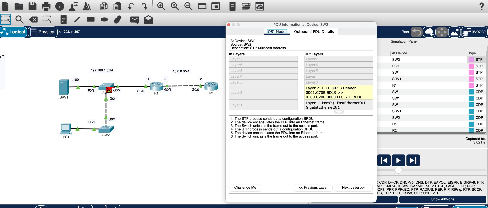
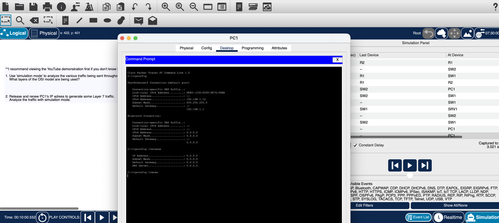
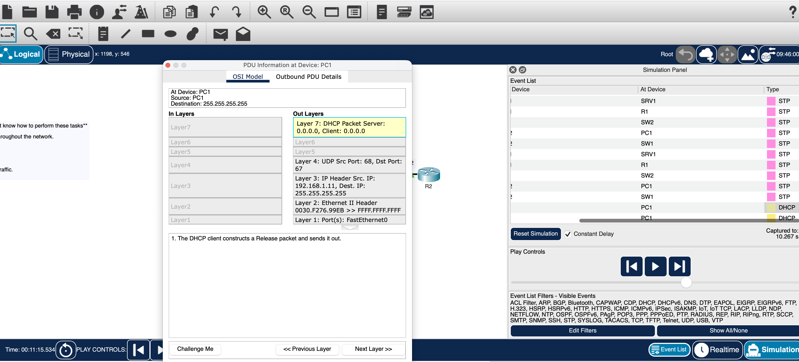

# Lab 03 — Identifying OSI Model Layers

## Overview

In this lab, I used Cisco Packet Tracer's Simulation Mode to identify which layers of the OSI model are involved as different types of network traffic move through a network.

The primary focus was learning how to inspect a Protocol Data Unit (PDU) and determine which OSI layers were being used.

I observed existing network traffic and then generated DHCP traffic from PC1 so I could compare how different protocols interact with different layers of the OSI model.

---

## Objectives

By completing this lab, I practiced:

- Using Cisco Packet Tracer Simulation Mode
- Inspecting Protocol Data Units (PDUs)
- Identifying active OSI layers
- Recognizing that different protocols use different OSI layers
- Following traffic through a network
- Examining information added at different layers
- Connecting OSI model concepts to observable network traffic
- Generating additional traffic for analysis

---

## Lab Approach

Before completing this lab on my own, I watched Jeremy's lab demonstration because two parts of the exercise were new to me:

- I had not previously used Packet Tracer's **Simulation Mode**
- I was not familiar with the `ipconfig /release` and `ipconfig /renew` commands

Watching the demonstration first helped me understand how to access and navigate Simulation Mode and how to generate DHCP traffic for analysis.

I then worked through the lab myself and used the PDU information to identify which OSI layers were involved in the different types of traffic I observed.

This lab was especially useful because it introduced me to a Packet Tracer feature and command-line tools that I had not used before.

---
## Lab Environment

| Component | Details |
|---|---|
| Platform | Cisco Packet Tracer |
| Analysis Tool | Simulation Mode |
| Routers | R1, R2 |
| Switches | SW1, SW2 |
| End Device | PC1 |
| Server | SRV1 |
| Networks | 192.168.1.0/24 and 10.0.0.0/24 |
| Example Traffic Observed | STP, CDP, DHCP |

---

## Network Topology

The lab used an existing network consisting of:

- Two routers
- Two switches
- One PC
- One server
- Two IPv4 networks

The purpose of the lab was not to build or configure the network.

Instead, I used the existing topology to observe traffic and identify how that traffic related to the OSI model.

---

## Using Simulation Mode

I switched Packet Tracer from **Realtime Mode** to **Simulation Mode**.

Simulation Mode allowed me to slow down network activity and examine individual PDUs as they traveled through the network.

For each PDU, I could inspect the **OSI Model** tab and see which layers were being used by that particular network event.

This allowed me to move beyond memorizing the seven OSI layers and actually observe them in use.

---

## Identifying Layer 2 Traffic

One of the events I inspected was an STP message generated by a switch.



*Inspecting an STP PDU to identify which OSI layer is being used.*

When I opened the PDU information, Packet Tracer showed activity at:

**Layer 2 — Data Link**

The information displayed included an IEEE 802.3 Ethernet header and an STP BPDU.

The upper OSI layers were not active for this event.

This demonstrated that network communication does not always need to use every layer of the OSI model.

Some network protocols can perform their function at Layer 2.

---

## Observing Other Network Traffic

While using Simulation Mode, I also saw other protocols being generated by the network, including CDP.

The purpose of observing these events was to examine their PDU information and determine which OSI layers were involved.

This also showed me that network devices generate traffic even when a user is not actively sending data.

---

## Generating Traffic for OSI Analysis

To observe traffic involving more of the OSI model, I generated DHCP traffic from PC1.

I first viewed PC1's current network configuration:

```text
ipconfig
```

I then released the current DHCP-assigned configuration:

```text
ipconfig /release
```

Finally, I requested an IP configuration again:

```text
ipconfig /renew
```



*Using `ipconfig /release` and `ipconfig /renew` to generate DHCP traffic for OSI-layer analysis.*

The purpose of these commands in this lab was not primarily to learn DHCP configuration.

They provided traffic that I could inspect through Packet Tracer's OSI Model view.

---

## Identifying the Layers Used by DHCP

After generating DHCP traffic, I opened the resulting PDU and examined its OSI information.



*Examining the layers involved in DHCP communication.*

This PDU involved several layers.

### Layer 7 — Application

Packet Tracer identified the DHCP message at Layer 7.

This showed me that DHCP operates as an application-layer protocol.

### Layer 4 — Transport

At Layer 4, I could see that DHCP was using **UDP**.

The PDU information displayed the UDP source and destination port information.

### Layer 3 — Network

At Layer 3, I could see the IP header containing source and destination IP addressing information.

### Layer 2 — Data Link

At Layer 2, the information was encapsulated inside an Ethernet frame.

I could see source and destination MAC address information in the Ethernet header.

### Layer 1 — Physical

At Layer 1, Packet Tracer identified the physical interface used to transmit the data.

---

## Comparing the Traffic

The different PDUs helped demonstrate that the OSI layers involved depend on the type of network communication taking place.

| Traffic Observed | Layers Observed | What It Demonstrated |
|---|---|---|
| STP | Layer 2 and Layer 1 transmission | Some network protocols operate without using the upper OSI layers |
| CDP | Primarily Layer 2 | Network devices can exchange information directly at the Data Link layer |
| DHCP | Layers 7, 4, 3, 2, and 1 | Application traffic relies on multiple lower layers to travel across a network |

The biggest takeaway was that I should not assume every packet uses all seven OSI layers.

Instead, I can inspect the traffic and determine which layers are actually involved.

---

## Understanding Encapsulation

Inspecting the PDUs also helped me visualize encapsulation.

As information moves down the networking stack, each applicable layer adds information needed to perform its function.

For the DHCP traffic I observed, I could follow the information through multiple layers:

```text
Layer 7 — DHCP
        ↓
Layer 4 — UDP
        ↓
Layer 3 — IP
        ↓
Layer 2 — Ethernet
        ↓
Layer 1 — Physical transmission
```

At the receiving device, the information can be processed back up through the appropriate layers.

Seeing this inside Packet Tracer made the relationship between the layers easier to understand than simply memorizing the OSI model.

---

## Commands Used

The commands used on PC1 were:

```text
ipconfig
ipconfig /release
ipconfig /renew
```

These commands were primarily used to generate DHCP traffic that I could inspect in Simulation Mode.

No Cisco IOS configuration was required for this lab.

---

## Verification

I completed the lab by:

1. Entering Packet Tracer Simulation Mode
2. Observing network-generated traffic
3. Selecting individual events from the Simulation Panel
4. Opening their PDU information
5. Reviewing the OSI Model tab
6. Identifying which layers were active
7. Comparing the layers used by different types of traffic
8. Generating DHCP traffic from PC1
9. Inspecting the DHCP PDU through multiple OSI layers

---

## What I Learned

The biggest lesson from this lab was that the OSI model represents functions that I can actually observe in network traffic.

Before this lab, it was easy to think about the OSI model mainly as seven layers to memorize.

Using Simulation Mode allowed me to see those layers applied to actual PDUs.

### Different Traffic Uses Different Layers

Not every type of network traffic uses every OSI layer.

For example, the STP traffic I examined primarily demonstrated Layer 2 behavior, while DHCP involved several layers of the networking stack.

### One Communication Can Involve Multiple Protocols

When I examined DHCP traffic, I wasn't only seeing DHCP.

I could also identify:

- DHCP at Layer 7
- UDP at Layer 4
- IP at Layer 3
- Ethernet at Layer 2
- Physical transmission at Layer 1

Each layer performed a different function required to move the communication across the network.

### The OSI Model Helps With Traffic Analysis

Instead of looking at network traffic as one large process, I can break it down by layer.

I can ask:

- Is the physical connection working?
- Is the Ethernet frame being delivered?
- Is IP addressing involved?
- Which transport protocol is being used?
- Which application protocol generated the traffic?

This gives me a more structured way to understand network communication and will also be useful when troubleshooting network problems.

---

## Study Source

This lab was completed as part of my CCNA studies using **Jeremy's IT Lab**.

The documentation, explanations, observations, and lessons learned in this repository are written in my own words as a record of my hands-on learning.
